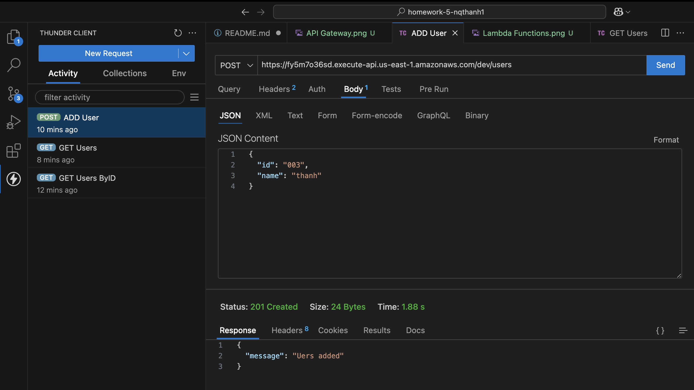

# MIU-Seminar-2025-03-Homework5
# Requirements
## Create and Deploy a Basic AWS Lambda Function
* Create a Lambda function in AWS.
* Write a simple function that returns a list of users:
```
[
  {name: "Peter", id: "01"},
  {name: "Michael", id: "02"},
  {name: "Ann", id: "03"},
]
```
* Test the function inside AWS Lambda Console.
## Set Up API Gateway to Expose the Lambda Function
* Create an API Gateway as REST API.
* Create a GET method that triggers the Lambda function.
* Deploy the API and obtain the API endpoint.
* Test using Postman or Curl. 
## Create a DynamoDB Table
* Create a DynamoDB table named users with:
* Primary Key: userId (String).
## Modify Lambda to Create Data from DynamoDB
* Modify the Lambda function to write data from DynamoDB.
* Accept input JSON and store data in DynamoDB.
* Query data from the database.
## Extend API to Retrieve Users from DynamoDB
* Modify the Lambda function to retrieve a user by userId.
* Accept userId as a path parameter.

## Submit screenshots demonstrating:
* Create and deploy AWS Lambda functions.

* Expose APIs using API Gateway.

* Store and retrieve data from DynamoDB.



